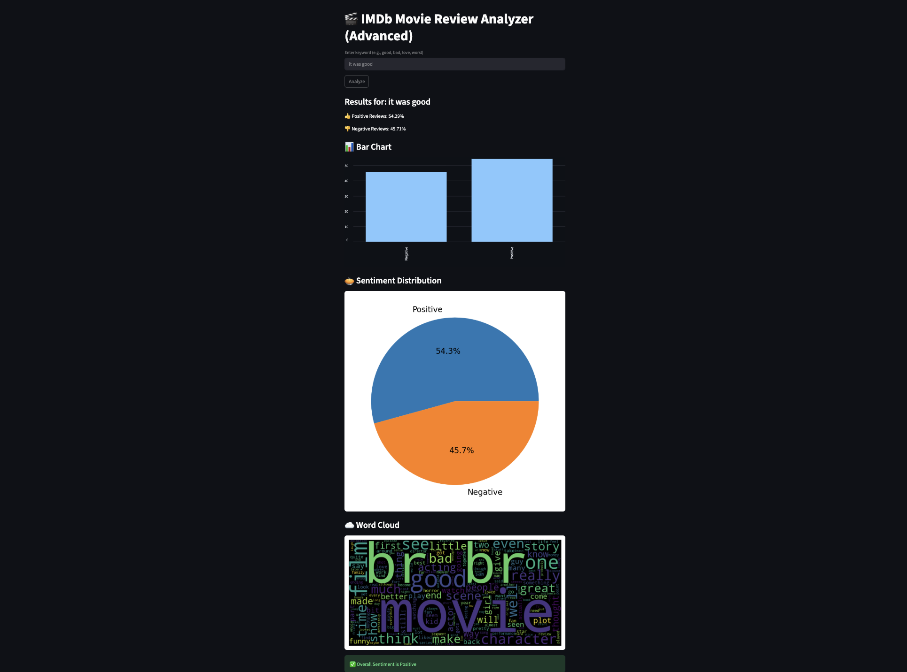

# 🎬 IMDb Movie Review Analyzer (Streamlit + NLP)

## 📌 Overview

This project analyzes movie reviews and determines the percentage of **positive** and **negative** sentiments using a real-world IMDb dataset of **50,000 reviews**.

It provides an interactive web interface where users can enter keywords and explore sentiment distribution with visualizations.

---

## 🚀 Features

* 📊 Real IMDb dataset (50K reviews)
* 🔍 Keyword-based filtering of reviews
* 👍👎 Sentiment analysis (Positive / Negative)
* 🌐 Interactive web app using Streamlit

### 📈 Visualizations

* Bar Chart
* Pie Chart
* Word Cloud

---

## 🛠 Tech Stack

* Python
* Pandas
* Streamlit
* Matplotlib
* WordCloud

---

## ▶️ How to Run

```bash
pip install -r requirements.txt
streamlit run app.py
```

---

## 📊 Example Use

Enter keywords like:

* good
* bad
* love
* worst

The app filters reviews containing the keyword and displays sentiment distribution.

---

## 📸 Screenshot



---

## 💡 Future Improvements

* 🤖 Add Machine Learning model for sentiment prediction
* 🌍 Integrate real-time movie reviews using APIs
* 🚀 Deploy application online

---

## 🧠 What I Learned

* Working with real-world datasets
* Data preprocessing using Pandas
* Building interactive apps with Streamlit
* Visualizing insights using charts and word clouds

